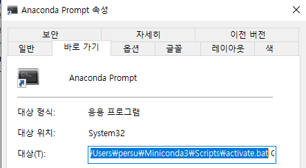

# 미니콘다 가상 환경 설정 및 윈도우 실행 배치 파일 만들기

[앞선 글](2018-12-31-tensorflow-with-miniconda.md)에서 미니콘다를 설치하는 방법을 다루었습니다.

파이썬 라이브러리는 다른 라이브러리들과 종속관계를 맺고 있습니다. 심지어 특정 라이브러리는 파이썬 버전에 종속관계가 있어서 파이썬 2.X에서만 되는 경우가 있고, 3.X에서만 되는 경우도 있습니다. 그렇기 때문에 여러가지 구현 프로젝트를 진행하다보면 라이브러리 종속 관계가 충돌이 가는 경우가 생기게 됩니다.

라이브러리 종속 관계 문제를 해결하는 방법은 가상 개발 환경을 설정하는 것 입니다. 라이브러리를 찾는 범위가 컴퓨터 전체가 아니라, 따로 지정한 디렉토리 내 에서만 찾아서 사용하도록 하는 것 입니다.

### 미니콘다 가상 개발 환경 만들기

`anaconda prompt`의 `conda create` 명령어로 가상 개발 환경을 만들 수 있습니다.

```sh
conda create --name [ENV_NAME] [PRE_INSTALL_PACKAGES]
```

`--name` 인자로 가상 개발 환경 이름을 정할 수 있습니다. `PRE_INSTALL_PACKAGES`는 파이썬 버전, 특정 패키지, 패키지 집합 등을 명시하여 설치할 수 있습니다.

예를 들어, 다음은 `mydev`라는 이름의 가상 개발 환경을 `python 3.5` 버전을 이용하고 `anaconda`의 모든 라이브러리를 추가하는 명령어 입니다.

```sh
conda create --name mydev python=3.5 anaconda
```

`activate [ENV_NAME]` 명령어를 이용해 특정 가상 개발 환경으로 전환 할 수 있습니다.

가상 개발 환경을 관리하는 추가적인 방법은 [공식 문서](https://conda.io/docs/user-guide/tasks/manage-environments.html)에서 확인하실 수 있습니다.

### jupyter notebook 자동 실행 bat 파일 만들기

jupyter를 이용해 개발하기 위해 처음 해야 하는 것은 jupyter를 실행하는 것 입니다. 이를 위해 `anaconda prompt`를 실행하고 가상 개발 환경으로 바꾸고 소스코드 개발하는 디렉토리를 이동한 다음에 `jupyter notebook`을 실행하는 단순한 작업을 해야 합니다.

단순한 작업은 배치 명령을 만들어 실행하면 쉽게 해결 할 수 있습니다.

```sh
call [MINICONDA_SCRIPT_PATH]\activate.bat [ENV_NAME]
cd [REPO_PATH]
jupyter notebook
```



미니콘다 스크립트 위치는 anaconda prompt의 속성을 보시면 알 수 있습니다. REPO_PATH는 본인이 작성하는 코드가 저장된 위치를 설정하시면 됩니다.

제가 사용하는 jupyter notebook 배치 파일은 다음과 같습니다.

```sh
call C:\Users\persu\Miniconda3\Scripts\activate.bat numpy
cd C:\git.repo\nn.rnn-numpy\
jupyter notebook
```