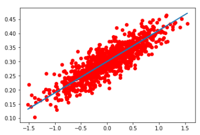
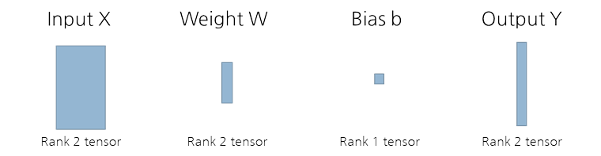
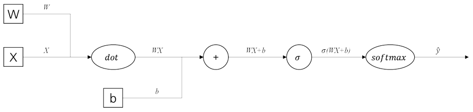
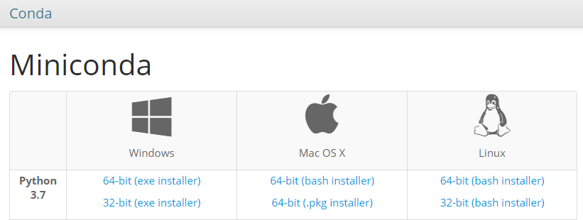
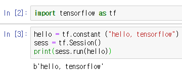

# 미니콘다로 텐서플로우 코딩하기 (windows 10)

본 문서는 windows 10 환경에서 미니콘다를 이용하여 텐서플로우를 다루는 방법을 다룹니다.

- [미니콘다로 텐서플로우 코딩하기 (windows 10)](#%EB%AF%B8%EB%8B%88%EC%BD%98%EB%8B%A4%EB%A1%9C-%ED%85%90%EC%84%9C%ED%94%8C%EB%A1%9C%EC%9A%B0-%EC%BD%94%EB%94%A9%ED%95%98%EA%B8%B0-windows-10)
    - [텐서플로우란?](#%ED%85%90%EC%84%9C%ED%94%8C%EB%A1%9C%EC%9A%B0%EB%9E%80)
      - [텐서와 플로우 예제](#%ED%85%90%EC%84%9C%EC%99%80-%ED%94%8C%EB%A1%9C%EC%9A%B0-%EC%98%88%EC%A0%9C)
        - [1) 텐서](#1-%ED%85%90%EC%84%9C)
        - [2) 계산 그래프 (플로우)](#2-%EA%B3%84%EC%82%B0-%EA%B7%B8%EB%9E%98%ED%94%84-%ED%94%8C%EB%A1%9C%EC%9A%B0)
    - [미니콘다란?](#%EB%AF%B8%EB%8B%88%EC%BD%98%EB%8B%A4%EB%9E%80)
      - [설치 URL](#%EC%84%A4%EC%B9%98-url)
        - [설치 확인](#%EC%84%A4%EC%B9%98-%ED%99%95%EC%9D%B8)
        - [설치 트러블 슈팅](#%EC%84%A4%EC%B9%98-%ED%8A%B8%EB%9F%AC%EB%B8%94-%EC%8A%88%ED%8C%85)
      - [초기 설정](#%EC%B4%88%EA%B8%B0-%EC%84%A4%EC%A0%95)
    - [텐서플로우 설치 확인](#%ED%85%90%EC%84%9C%ED%94%8C%EB%A1%9C%EC%9A%B0-%EC%84%A4%EC%B9%98-%ED%99%95%EC%9D%B8)

### 텐서플로우란?

> 텐서 + 플로우 = 텐서플로우

`텐서`는 n차원의 일반화된 행렬 입니다.
`플로우`는 `입력 텐서`로 부터 `출력 텐서`까지의 계산 그래프 입니다.
이 두가지 도구로 `신경망`을 설계하는 도구가 `텐서플로우`입니다.

#### 텐서와 플로우 예제

선형 회귀 문제를 신경망으로 풀기 위한 텐서와 플로우의 예제입니다.

선형 회귀 문제는 입력값$X$와 출력값$Y$의 쌍이 주어졌을 때 이를 가장 잘 표현하는 선형 방정식을 찾아내는 문제 입니다.


[X축 : 입력 값, Y축 : 출력 값, 청색 선 : 선형 방정식]
(이미지 출처 : http://thoughtschangeworld.blogspot.com/2018/03/tensorflow-linear-regression.html)

##### 1) 텐서



입력값 $X$, 출력값 $Y$가 주어졌을 때, 이를 매핑하기 위한 가중치 행렬 $W$와 바이어스 $b$를 만듭니다.

가중치와 바이어스는 선형 방정식을 만들기 위해 사용되는 파라미터 입니다. 예를 들면 $y=3x+1$의 선형 방정식이 있을 때, $3$이 가중치, $+1$이 바이어스 입니다.

* 위 그림는 n차원의 입력값, 1차원의 출력값에 대한 로지스틱 회귀 방법론을 가정하여 그렸습니다.

##### 2) 계산 그래프 (플로우)



입력 값 $X$로부터 예측값 $\hat{y}$를 만드는 계산 과정을 그래프의 형태로 표현합니다.

가중치와 바이어스는 정답 $Y$와 예측값 $\hat{y}$의 차이만큼 갱신합니다. 차이를 구하고, 기울기를 갱신하는 최적화 작업은 사용자가 정한 `텐서`와 `플로우`와 몇가지 하이퍼 파라미터를 토대로 `텐서플로우`가 자동으로 만들어줍니다.

### 미니콘다란?

미니콘다는 프로그래밍 환경 구축 및 패키지 저장소 관리를 도와주는 도구 입니다. 텐서플로우 설치를 쉽게 도와주는 역할을 합니다.

미니콘다는 콘다의 배포판 중에 하나입니다. 최소 버전이 미니콘다, all-in-one 버전이 아나콘다라 생각하시면 됩니다.

#### 설치 URL

https://conda.io/miniconda.html



- python 3.x로 다운받아 설치합니다.

##### 설치 확인

`시작` -> `anaconda prompt` 를 실행하여 확인합니다.

##### 설치 트러블 슈팅

- 환경 변수에 다른 python path 가 있을 경우 anaconda prompt가 실행되지 않습니다.
  - PYTHON_HOME와 PYTHONPATH을 삭제하거나 아나콘다와 맞게 설정을 다시 해주면 됩니다.
  - 출처 : http://kjk92.tistory.com/14

#### 초기 설정

```bash
# 콘다 업데이트
conda update conda
# tensorflow-gpu 설치
## cpu 버전 설치 필요 시 tensorflow-gpu 대신 tensorflow 패키지 설치
conda install tensorflow-gpu
# jupyter 설치
conda install jupyter
# jupyter notebook 실행
## 현재 명령 프롬프트 위치에서 실행되므로, 적절한 위치로 이동 후 실행
jupyter notebook
```

### 텐서플로우 설치 확인

다음의 코드는 텐서 플로우에 상수를 추가하고, 실행하는 간단한 예제입니다.

```py
import tensorflow as tf

hello = tf.constant ("hello, tensorflow")
sess = tf.Session()
print(sess.run(hello))
```

실행 결과 예는 다음과 같습니다.

